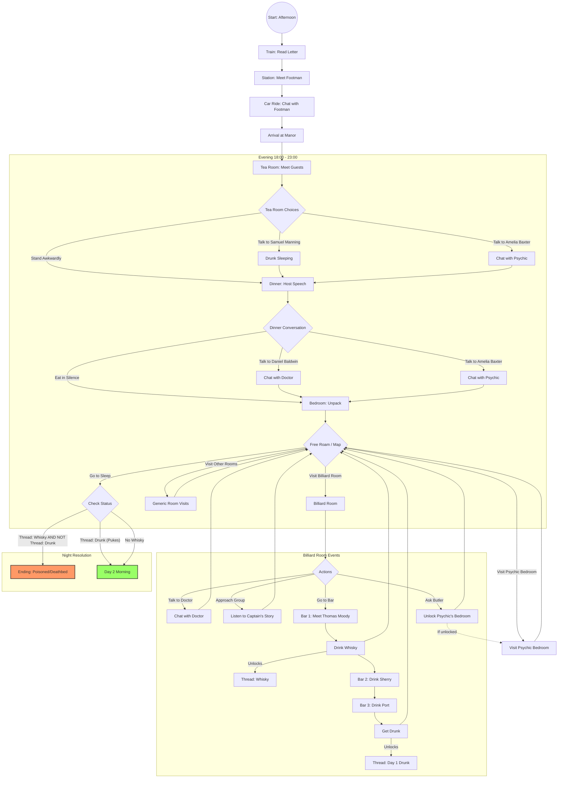

# Lad - Day 1 Story Flow (BETA Try)

This chart represents the narrative flow, choices, and potential endings for the "Lad" character on Day 1.

## Key Decision Points

1.  **Billiard Room - Bar**: This is the critical path.
    *   **Meeting Thomas Moody** triggers the first drink (Whisky). This sets the `whisky` thread.
    *   **Drinking too much (3 drinks)** sets the `day1_drunk` thread.
2.  **Survival Logic**:
    *   The Whisky is poisoned (or causes the death condition).
    *   If you get **Drunk**, you vomit in your room, expelling the poison.
    *   **Equation**: `Whisky + Not Drunk = Death`. `Whisky + Drunk = Survival`. `No Whisky = Survival`.

## Minor Choices
*   **Social**: Conversations in Tea Room and Dinner affect relationship threads (generic interactions) but don't strictly branch the main plotline for Day 1.
*   **Psychic Room**: Asking the Butler allows you to knock on Amelia's door, but she turns you away.
