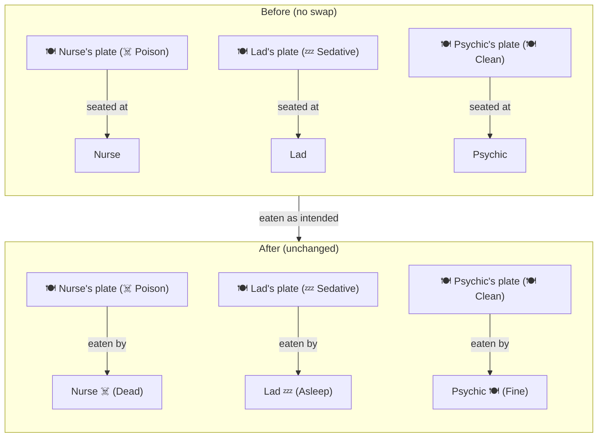
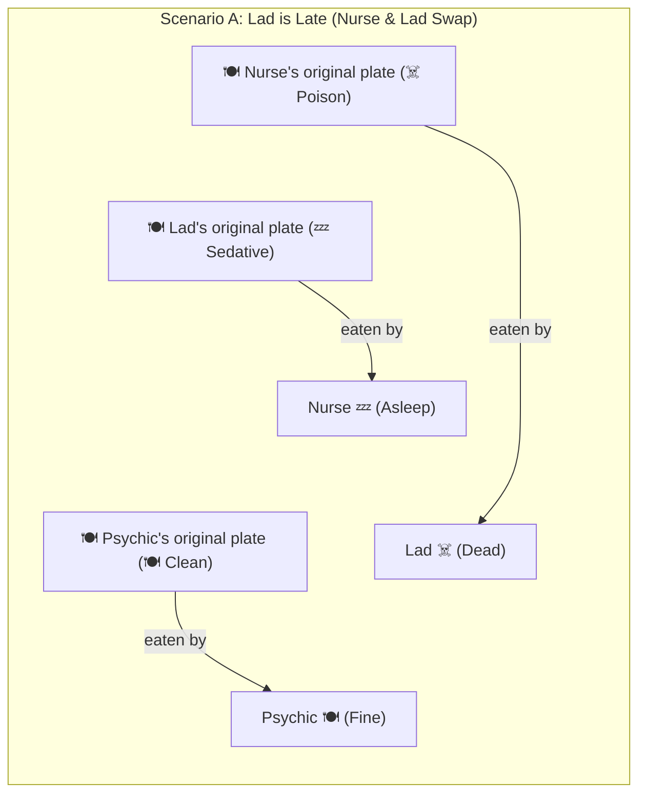
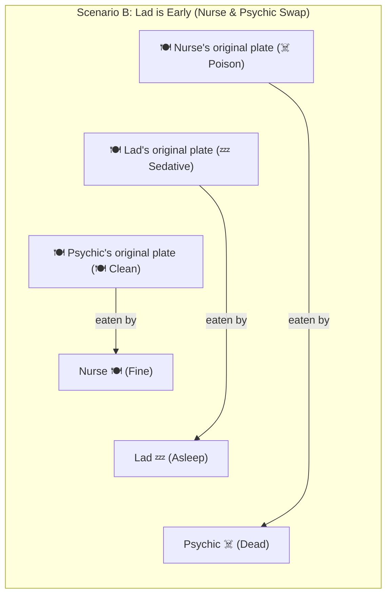

# Day 3 Afternoon — Poisoning & Plate Swaps

The psychic wants to kill the nurse, so she poisoned her plate.
But she wants to sedate the lad (Ted Harring), so she gives him a sedative.

But the plates will be switched, so the ending is not always what was planned.

**Legend:**
- ☠️ **Poison:** Deadly (Strychnine)
- 💤 **Sedative:** Sleeping pills
- 🍽️ **Clean:** Normal food

## Base Scenario (No Swaps)

## First encounter - Lad

### Scenario A: Lad is Late
He comes late and didn't notice the nurse switching their plates, so he eats hers and vice versa.

### Scenario B: Lad is Early
He comes back early and forces the nurse to change her plate with the psychic.

