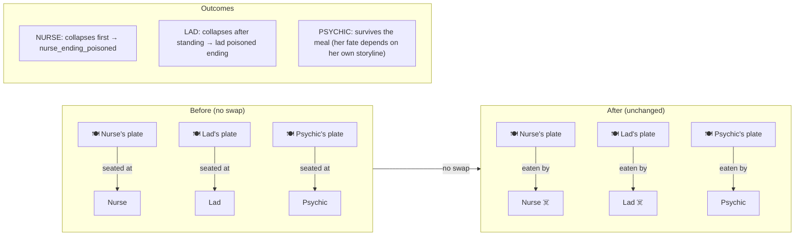
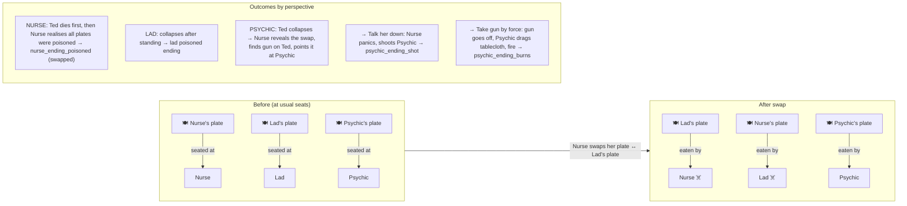
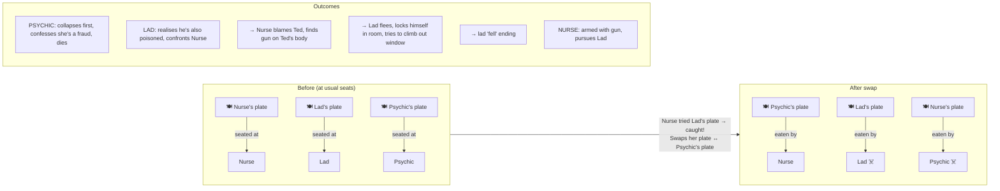

# Day 3 Afternoon — Poisoning & Plate Swaps

All three plates are poisoned (the food itself, from the same pot).
Three diners: **Nurse** (Rosalind Marsh), **Lad** (Ted Harring), **Psychic** (Amelia Baxter).

Nurse is left alone with the plates before the meal. Her choice — and whether Ted catches her — determines who eats what.

---

## Scenario 1: No Swap (Nurse leaves plates as they are)

> Nurse perspective: chooses "Leave the plates as they are"
> Lad perspective: goes to the toilet (default / paranoid choice)

---

## Scenario 2: Nurse Swaps with Lad (undetected)

> Nurse perspective: chooses "Swap my plate with Mr Harring's"
> Lad perspective: goes to the toilet (default / paranoid choice) — doesn't witness the swap
> Psychic perspective: returns to find everyone seated

---

## Scenario 3: Nurse Caught — Swaps with Psychic Instead

> Lad perspective only: chooses "Hold it in and go back downstairs" (intuition, requires `poisoned` ending unlocked)
> Lad catches Nurse holding his plate, refuses the swap
> Nurse swaps her plate with Psychic's instead

---

## Summary Table

| Scenario | Nurse eats | Lad eats | Psychic eats | First to die | Trigger |
|----------|-----------|----------|-------------|-------------|---------|
| 1. No swap | her own plate | his own plate | her own plate | Nurse (nurse POV) / Lad (lad POV) | Nurse: "Leave plates" |
| 2. Nurse ↔ Lad | Lad's plate | Nurse's plate | her own plate | Lad (Ted) | Nurse: "Swap with Mr Harring's" |
| 3. Nurse ↔ Psychic | Psychic's plate | his own plate | Nurse's plate | Psychic (Amelia) | Lad catches Nurse, she swaps with Psychic |
