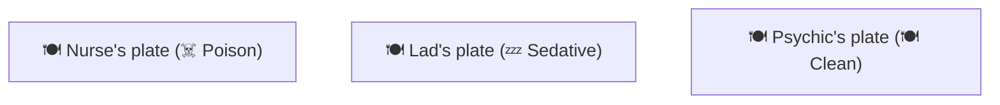
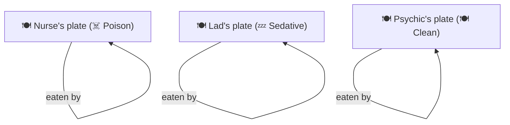
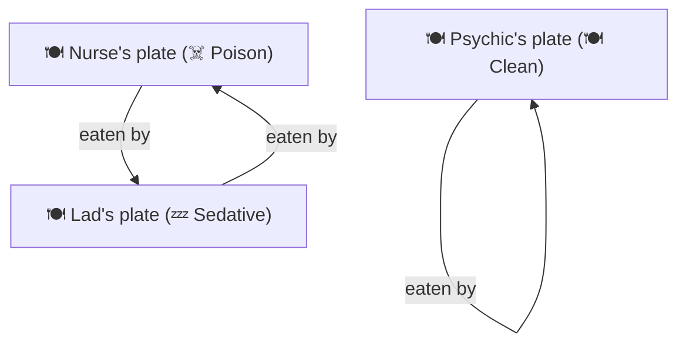
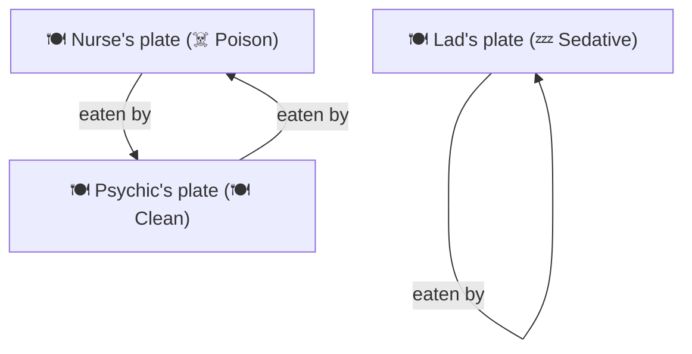

# Day 3 Afternoon — Poisoning & Plate Swaps 
## DRAFT (TODO Add doctor, nurse path, and better charts)

The psychic wants to kill the nurse, so she poisoned her plate.
But she wants to sedate the lad (Ted Harring), so she gives him a sedative.

But the plates will be switched, so the ending is not always what was planned.

**Legend:**
- ☠️ **Poison:** Deadly (Strychnine)
- 💤 **Sedative:** Sleeping pills
- 🍽️ **Clean:** Normal food

## Base Scenario (No Swaps)

### Initial State

### Outcome (No Swaps)

## Lad Path

### Scenario A: Normal
He comes late and didn't notice the nurse switching their plates, so he eats hers and vice versa.

### Scenario B: Lad is Early
He comes back early and forces the nurse to change her plate with the psychic.

