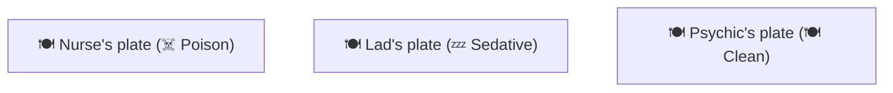
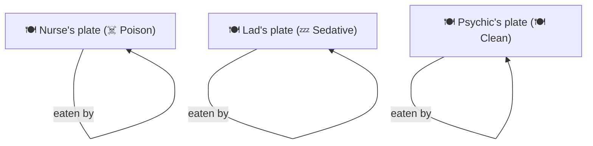
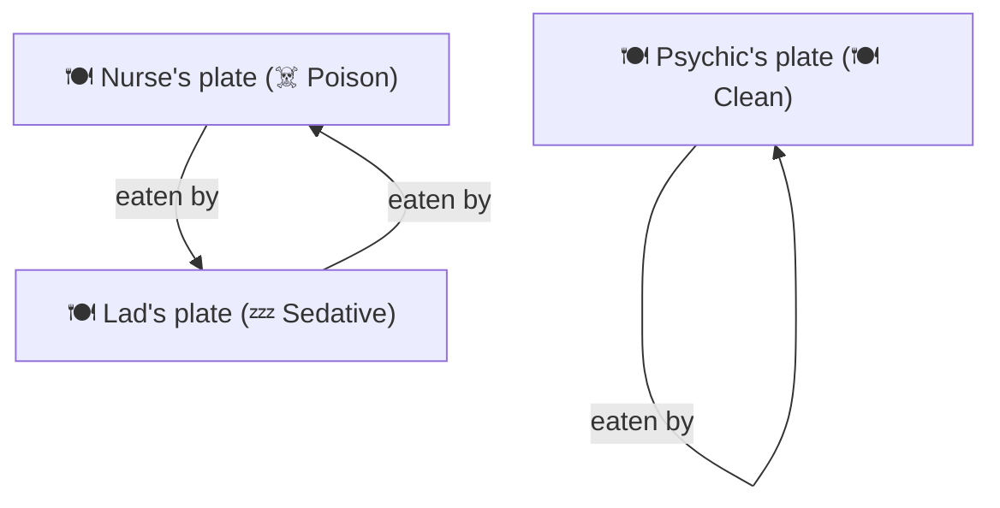
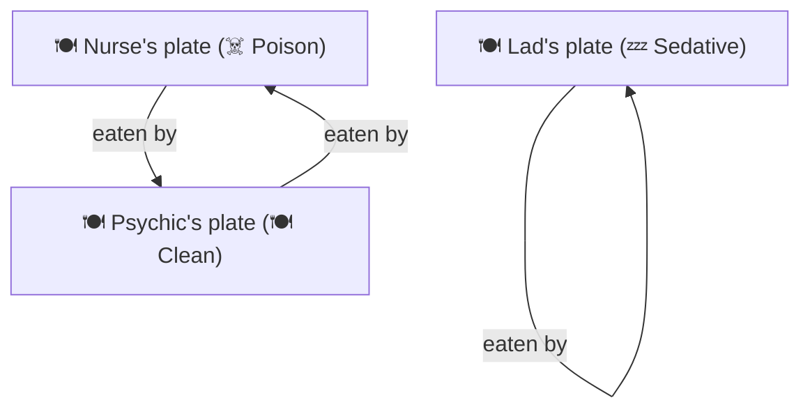
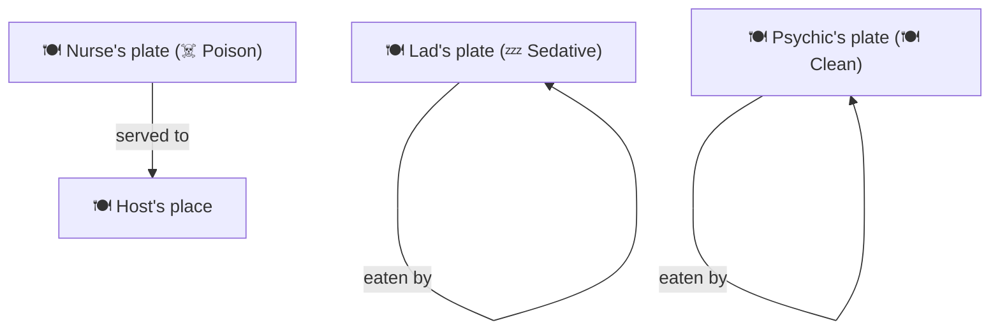

# Day 3 Afternoon — Poisoning & Plate Swaps 
## DRAFT (TODO Add doctor, nurse path, and better charts)

The psychic wants to kill the nurse, so she poisoned her plate.
But she wants to sedate the lad (Ted Harring), so she gives him a sedative.

But the plates will be switched, so the ending is not always what was planned.

**Legend:**
- ☠️ **Poison:** Deadly (Strychnine)
- 💤 **Sedative:** Sleeping pills
- 🍽️ **Clean:** Normal food

## Base Scenario (No Swaps)

### Initial State

```mermaid
graph TB
    nurse_poison["🍽️ Nurse's plate (☠️ Poison)"]
    lad_sedative["🍽️ Lad's plate (💤 Sedative)"]
    psychic_clean["🍽️ Psychic's plate (🍽️ Clean)"]
```

### Outcome (No Swaps)

```mermaid
graph TB
    nurse_poison["🍽️ Nurse's plate (☠️ Poison)"]
    lad_sedative["🍽️ Lad's plate (💤 Sedative)"]
    psychic_clean["🍽️ Psychic's plate (🍽️ Clean)"]

    nurse_poison -->|eaten by| nurse_poison
    lad_sedative -->|eaten by| lad_sedative
    psychic_clean -->|eaten by| psychic_clean
```

## Lad Path

### Scenario A: Normal
He comes late and didn't notice the nurse switching their plates, so he eats hers and vice versa.

```mermaid
graph TB
    nurse_poison["🍽️ Nurse's plate (☠️ Poison)"]
    lad_sedative["🍽️ Lad's plate (💤 Sedative)"]
    psychic_clean["🍽️ Psychic's plate (🍽️ Clean)"]

    nurse_poison -->|eaten by| lad_sedative
    lad_sedative -->|eaten by| nurse_poison
    psychic_clean -->|eaten by| psychic_clean
```

### Scenario B: Lad is Early
He comes back early and forces the nurse to change her plate with the psychic.

```mermaid
graph TB
    nurse_poison["🍽️ Nurse's plate (☠️ Poison)"]
    lad_sedative["🍽️ Lad's plate (💤 Sedative)"]
    psychic_clean["🍽️ Psychic's plate (🍽️ Clean)"]

    nurse_poison -->|eaten by| psychic_clean
    lad_sedative -->|eaten by| lad_sedative
    psychic_clean -->|eaten by| nurse_poison
```

## Host Path

Only reachable without a car: the captain has gone for the town on foot, so the host goes in to the lad and the psychic alone, and the nurse never comes down. Three at the table. The psychic keeps the sedative for the lad and gives the plate meant for the nurse to the host. There is no swap and nothing for the host to read.

```mermaid
graph TB
    nurse_poison["🍽️ Nurse's plate (☠️ Poison)"]
    lad_sedative["🍽️ Lad's plate (💤 Sedative)"]
    host_clean["🍽️ Host's place"]
    psychic_clean["🍽️ Psychic's plate (🍽️ Clean)"]

    nurse_poison -->|served to| host_clean
    lad_sedative -->|eaten by| lad_sedative
    psychic_clean -->|eaten by| psychic_clean
```

The host dies at the table, first. The lad goes to sleep after her.

With a car the host never sits down to lunch: either she and the captain leave at once (intuition) or the whole house gets into the car and it is stopped in the wood. If she hides in the attic instead, lunch happens without her (lad path, scenario A) and she comes down to Samuel Manning alive among the dead.
