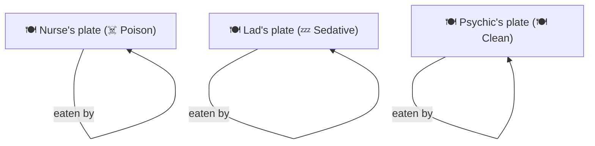
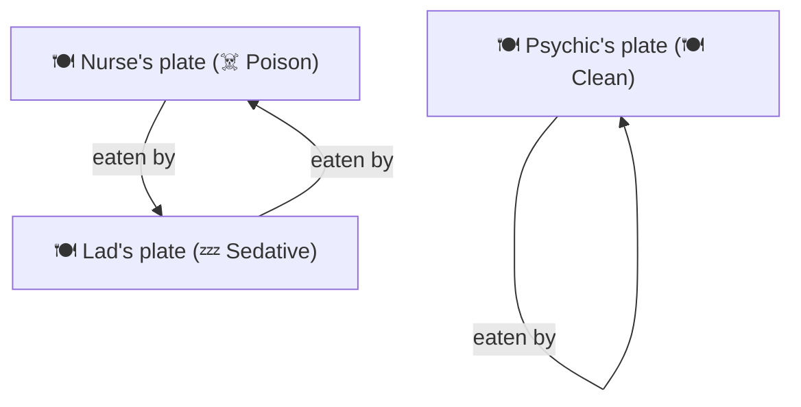
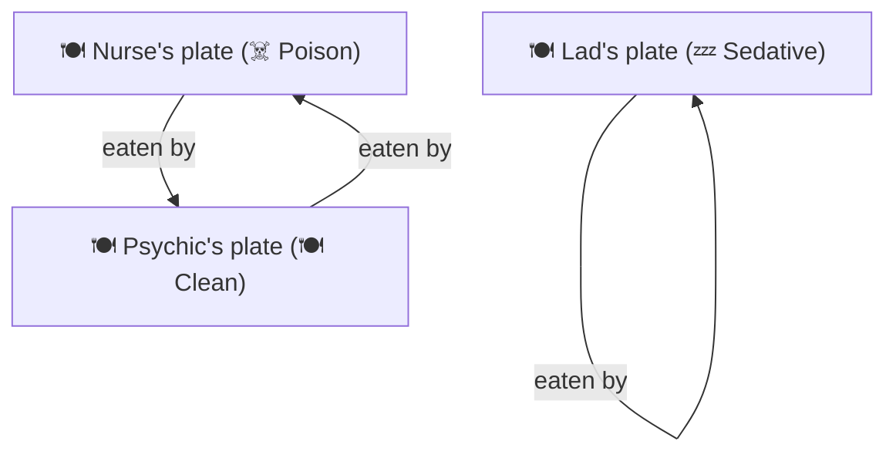

# Day 3 Afternoon — Poisoning & Plate Swaps 
## DRAFT (TODO Add doctor, nurse path, and better charts)

The psychic wants to kill the nurse, so she poisoned her plate.
But she wants to sedate the lad (Ted Harring), so she gives him a sedative.

But the plates will be switched, so the ending is not always what was planned.

**Legend:**
- ☠️ **Poison:** Deadly (Strychnine)
- 💤 **Sedative:** Sleeping pills
- 🍽️ **Clean:** Normal food

## Base Scenario (No Swaps)

### Initial State

```mermaid
graph TB
    nurse_poison["🍽️ Nurse's plate (☠️ Poison)"]
    lad_sedative["🍽️ Lad's plate (💤 Sedative)"]
    psychic_clean["🍽️ Psychic's plate (🍽️ Clean)"]
```

### Outcome (No Swaps)

```mermaid
graph TB
    nurse_poison["🍽️ Nurse's plate (☠️ Poison)"]
    lad_sedative["🍽️ Lad's plate (💤 Sedative)"]
    psychic_clean["🍽️ Psychic's plate (🍽️ Clean)"]

    nurse_poison -->|eaten by| nurse_poison
    lad_sedative -->|eaten by| lad_sedative
    psychic_clean -->|eaten by| psychic_clean
```

## Lad Path

### Scenario A: Normal
He comes late and didn't notice the nurse switching their plates, so he eats hers and vice versa.

```mermaid
graph TB
    nurse_poison["🍽️ Nurse's plate (☠️ Poison)"]
    lad_sedative["🍽️ Lad's plate (💤 Sedative)"]
    psychic_clean["🍽️ Psychic's plate (🍽️ Clean)"]

    nurse_poison -->|eaten by| lad_sedative
    lad_sedative -->|eaten by| nurse_poison
    psychic_clean -->|eaten by| psychic_clean
```

### Scenario B: Lad is Early
He comes back early and forces the nurse to change her plate with the psychic.

```mermaid
graph TB
    nurse_poison["🍽️ Nurse's plate (☠️ Poison)"]
    lad_sedative["🍽️ Lad's plate (💤 Sedative)"]
    psychic_clean["🍽️ Psychic's plate (🍽️ Clean)"]

    nurse_poison -->|eaten by| psychic_clean
    lad_sedative -->|eaten by| lad_sedative
    psychic_clean -->|eaten by| nurse_poison
```

## Host Path

The host never sits down to Sunday lunch. She and the captain have agreed to say nothing to the others, so at noon it is the two of them: out in the car if she found the car and the petrol, on foot with him otherwise, or she sends him alone and hides in the attic. On the attic path lunch happens without her (lad path, scenario A) and she comes down at three to Samuel Manning alive among the dead.
