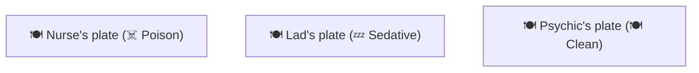
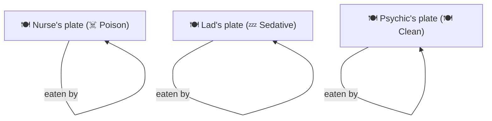
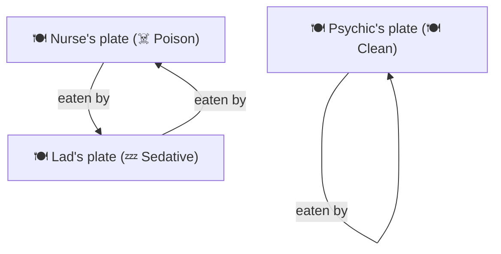
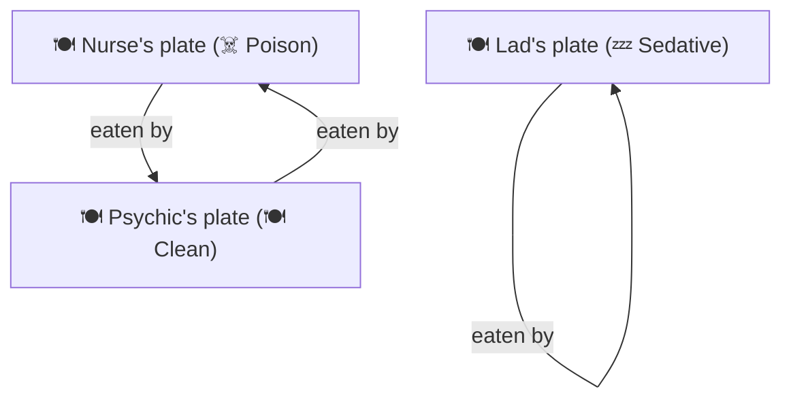
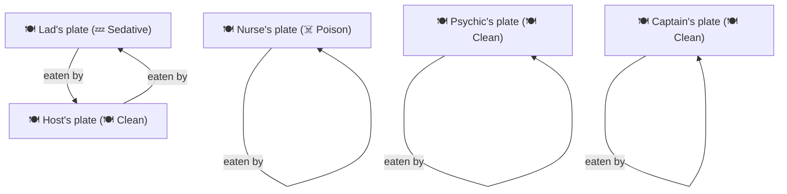

# Day 3 Afternoon — Poisoning & Plate Swaps 
## DRAFT (TODO Add doctor, nurse path, and better charts)

The psychic wants to kill the nurse, so she poisoned her plate.
But she wants to sedate the lad (Ted Harring), so she gives him a sedative.

But the plates will be switched, so the ending is not always what was planned.

**Legend:**
- ☠️ **Poison:** Deadly (Strychnine)
- 💤 **Sedative:** Sleeping pills
- 🍽️ **Clean:** Normal food

## Base Scenario (No Swaps)

### Initial State

```mermaid
graph TB
    nurse_poison["🍽️ Nurse's plate (☠️ Poison)"]
    lad_sedative["🍽️ Lad's plate (💤 Sedative)"]
    psychic_clean["🍽️ Psychic's plate (🍽️ Clean)"]
```

### Outcome (No Swaps)

```mermaid
graph TB
    nurse_poison["🍽️ Nurse's plate (☠️ Poison)"]
    lad_sedative["🍽️ Lad's plate (💤 Sedative)"]
    psychic_clean["🍽️ Psychic's plate (🍽️ Clean)"]

    nurse_poison -->|eaten by| nurse_poison
    lad_sedative -->|eaten by| lad_sedative
    psychic_clean -->|eaten by| psychic_clean
```

## Lad Path

### Scenario A: Normal
He comes late and didn't notice the nurse switching their plates, so he eats hers and vice versa.

```mermaid
graph TB
    nurse_poison["🍽️ Nurse's plate (☠️ Poison)"]
    lad_sedative["🍽️ Lad's plate (💤 Sedative)"]
    psychic_clean["🍽️ Psychic's plate (🍽️ Clean)"]

    nurse_poison -->|eaten by| lad_sedative
    lad_sedative -->|eaten by| nurse_poison
    psychic_clean -->|eaten by| psychic_clean
```

### Scenario B: Lad is Early
He comes back early and forces the nurse to change her plate with the psychic.

```mermaid
graph TB
    nurse_poison["🍽️ Nurse's plate (☠️ Poison)"]
    lad_sedative["🍽️ Lad's plate (💤 Sedative)"]
    psychic_clean["🍽️ Psychic's plate (🍽️ Clean)"]

    nurse_poison -->|eaten by| psychic_clean
    lad_sedative -->|eaten by| lad_sedative
    psychic_clean -->|eaten by| nurse_poison
```

## Host Path

Five at the table: the host, the captain, the lad, the psychic and the nurse. The host arrives as the nurse is swapping her plate with the lad's, and she undoes it her own way: she gives the lad her own (clean) plate, gives the nurse "her" plate back (the one the nurse got rid of, the poisoned one), and keeps the plate the nurse wanted (the lad's, the sedative) for herself.

```mermaid
graph TB
    nurse_poison["🍽️ Nurse's plate (☠️ Poison)"]
    lad_sedative["🍽️ Lad's plate (💤 Sedative)"]
    host_clean["🍽️ Host's plate (🍽️ Clean)"]
    psychic_clean["🍽️ Psychic's plate (🍽️ Clean)"]
    captain_clean["🍽️ Captain's plate (🍽️ Clean)"]

    nurse_poison -->|eaten by| nurse_poison
    lad_sedative -->|eaten by| host_clean
    host_clean -->|eaten by| lad_sedative
    psychic_clean -->|eaten by| psychic_clean
    captain_clean -->|eaten by| captain_clean
```

The nurse dies at the table and the host falls asleep. What happens between the captain, the lad and the psychic after that is off-screen (shots, heard by Samuel Manning from his room). The host wakes at three with everyone dead, Manning alive, and the butler's car on the gravel.
