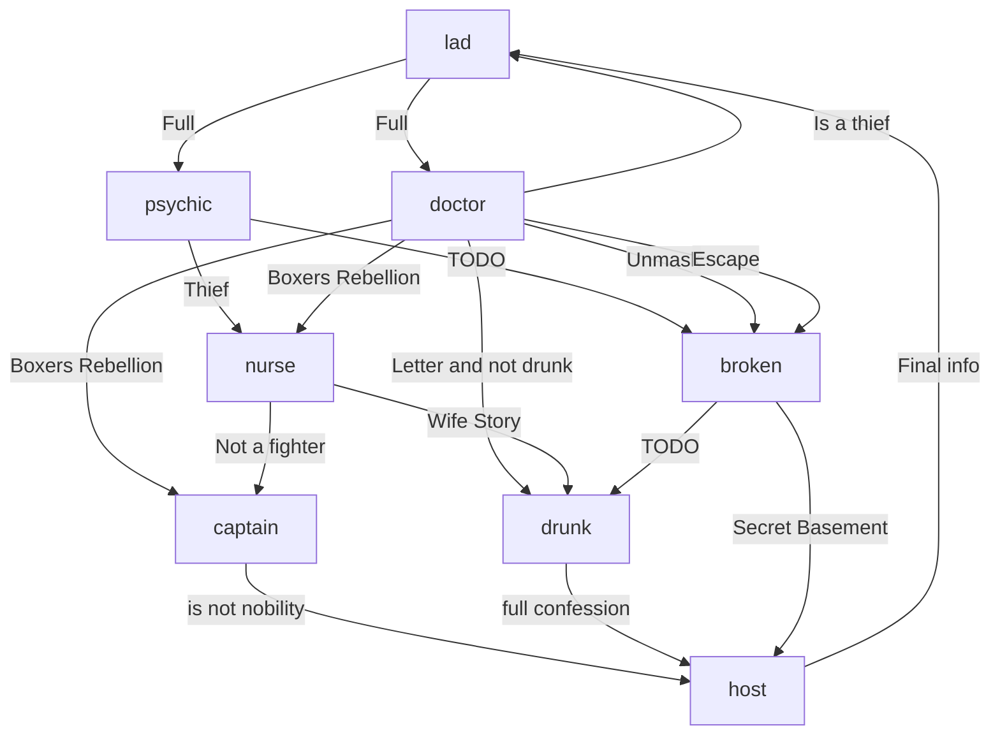

# 🔓 Character Unlocking Chart

> Use this chart to track how characters and routes are unlocked.

## 1. The Lad
First character, from there it's possible to unlock fully the psychic and the doctor.

## 2.1 Psychic

## 2.2 Doctor

## 3.1 Nurse
Is unlocked by information found in Doctor & Psychic
Can unlock Captain ? Or just part of captain ?

## 3.2 Broken
Can be unlocked by doctor ? And other? or just doctor is enough?

## 4.1 Captain
Can be unlocked by NURSE ? and other for trivial things?

## 4.2 Drunk
TODO be unlocked by Broken ? How?

## 5 Host
The last piece of the puzzle, needs info from DRUNK & Captain

## 6 The last run
After unlocking full information on the lad

