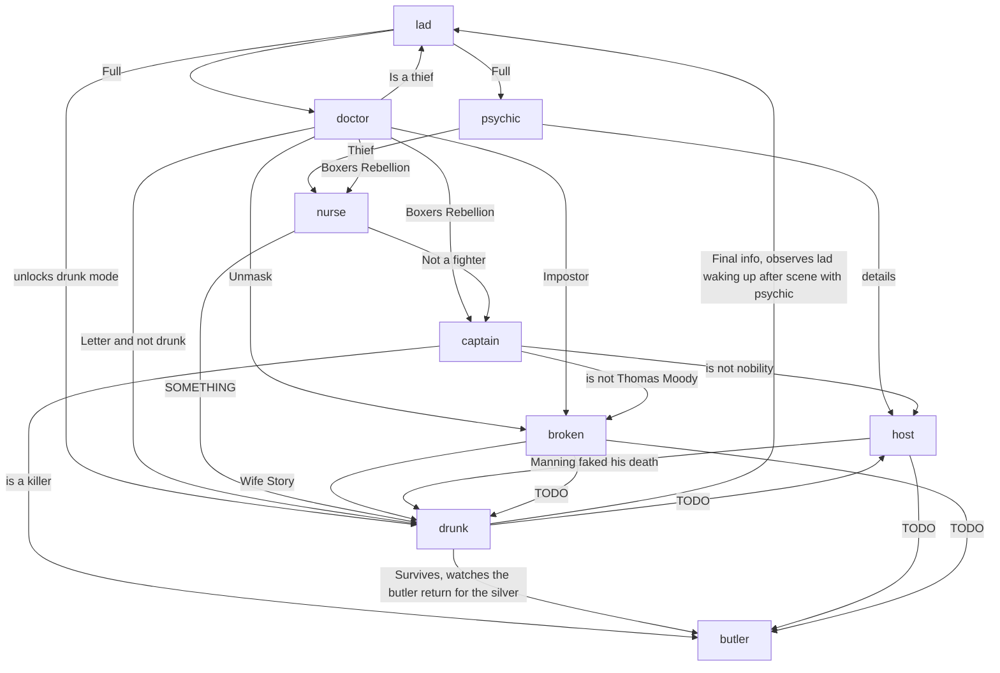

# 🔓 Character Unlocking Chart

> Use this chart to track how characters and routes are unlocked.

```mermaid
graph TD;
    lad -->|Full| doctor;
    lad -->|Full| psychic;
    lad -->|unlocks drunk mode| drunk;
    psychic -->|Thief| nurse;
    psychic -->|details| host;
    doctor -->|Boxers Rebellion | nurse;
    doctor -->|Boxers Rebellion| captain;
    doctor -->|Letter and not drunk| drunk;
    doctor -->|Unmask| broken;
    doctor -->|Is a thief| lad;
    doctor -->|Impostor| broken;
    nurse -->|Not a fighter| captain;
    nurse -->|SOMETHING| drunk;
    captain -->|is not nobility| host;
    captain -->|is not Thomas Moody| broken;
    broken -->|Wife Story| drunk;
    drunk -->|Final info, observes lad waking up after scene with psychic| lad;
    captain -->|is a killer| butler;
    drunk -->|Survives, watches the butler return for the silver| butler;
    drunk -->|TODO| host;
    host -->|Manning faked his death| drunk;
    host -->|TODO| butler;
    broken -->|TODO| butler;
    broken -->|TODO| drunk;
```

## 1. The Lad
First character, from there it's possible to unlock fully the psychic and the doctor.

## 2.1 Psychic

## 2.2 Doctor

## 3.1 Nurse
Is unlocked by information found in Doctor & Psychic
Can unlock Captain ? Or just part of captain ?

## 4.1 Captain
Can be unlocked by NURSE ? and other for trivial things?

## 5 Broken
Can be unlocked by doctor ? And other? or just doctor is enough?

## 5 Host
The last piece of the puzzle, needs info from DRUNK & Captain

## 6 Drunk

Samuel Manning's storyline is written (`scripts/drunk/`). It is a self-contained roguelike arc rather than a piece unlocked from others:

- **First run is forced.** After the doctor's letter on Friday night, the only choice is to drink, so he wakes hungover, takes a whisky flask into the woods, and shoots Daniel Baldwin blind drunk. That death (`despair`) is an intuition ending, and it unlocks the Friday-night choice to put the bottle down.
- **Once sober**, the tree opens: watered flask -> controlled hunt -> shoot the doctor deliberately (`shot_doctor`) to move on, or lower the rifle and be tidied away in the night (`spared`).
- **Locked in his room on Saturday night**, he reasons the whole plot out with a self-talk menu (the letter, the dead telephone line, the butler's face). If he understands it, he can play dead with port for blood (`played_dead`, needs the `port` bottle he takes from the billiard-room bar on Friday), accept his fate and cut his own throat for real (`throat_cut`), or warn the house and be silenced by the one person who believes him (`silenced`).
- **Sunday**, playing dead, the Captain pronounces him dead without touching him. He then witnesses the dining-room poisoning and can swap the plates back to save Ted Harring, escaping before the butler's car returns (`survived`), or freeze and be found by the butler, who checks the bed the Captain did not (`found_out`).

The last piece of his own backstory (`lost_case`) lands on the survived Sunday: he recognises Amelia Baxter as the client he was too drunk to defend years ago, which is why he was on the guest list.

Cross-character unlocks he provides: the **lad** (he watches Ted Harring wake to the butler's greeting) and the **butler** (appears in the roster, plus `manages_weekend`, `job`, `mob`, `took_valuables`, on the survived path).

The Host also reaches him from her side: on the Sunday afternoon, if she stays for lunch, Samuel Manning wakes her in the dining room and tells her how he faked his own death (`faked_death`, plus `lie`). `food` still needs its host-side unlock site (the Friday dinner, see next_tasks.md).

## 7 The last run
After unlocking full information on the lad

